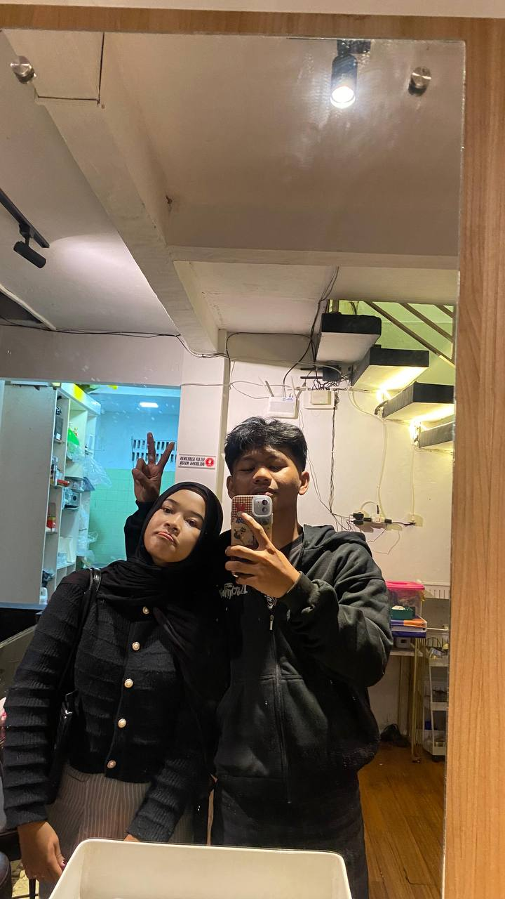

<!DOCTYPE html>
<html lang="id">
<head>
  <meta charset="UTF-8" />
  <meta name="viewport" content="width=device-width, initial-scale=1.0" />
  <title>Kejutan dari Arif 💌</title>
  
</head>
<body>
  

    <h1>Hai, Alya 💕</h1>
    
💖💞

    
Masukkan nama dan kata sandi rahasiamu untuk membuka kejutan spesial 💌

    <input type="text" id="nama" placeholder="Masukkan namamu" />
    <input type="password" id="sandi" placeholder="Masukkan kata sandi" />
    <button onclick="bukaKejutan()">Buka Kejutan 💝</button>
  

  

    <h2>🎉 Hai Alya! 🎉</h2>
    
Terima kasih sudah membuka kejutan ini 💖 
    Kamu adalah sosok yang istimewa dan selalu membawa warna di hari Arif 🌸

    
💌💞🌷✨

  

  
</body>
</html>

<html lang="id">
<head>
  <meta charset="UTF-8" />
  <meta name="viewport" content="width=device-width, initial-scale=1.0" />
  <title>🎉 Selamat Ulang Tahun 🎂</title>
  
</head>
<body>
  <button onclick="showSurprise()">🎁 Lihat Kejutan</button>

  

    

      
      
    

    <h1>🎉 Selamat Ulang Tahun Sayang ! 🎂</h1>
    

      Semoga hari istimewa ini penuh tawa, kebahagiaan, dan cinta.  
      Teruslah menjadi pribadi yang baik, hangat, dan menginspirasi.  
      Semoga semua impianmu perlahan menjadi nyata 💖
    

  

  
</body>
</html>
